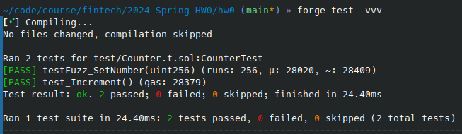
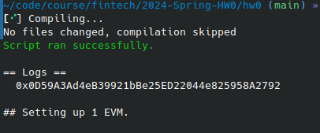
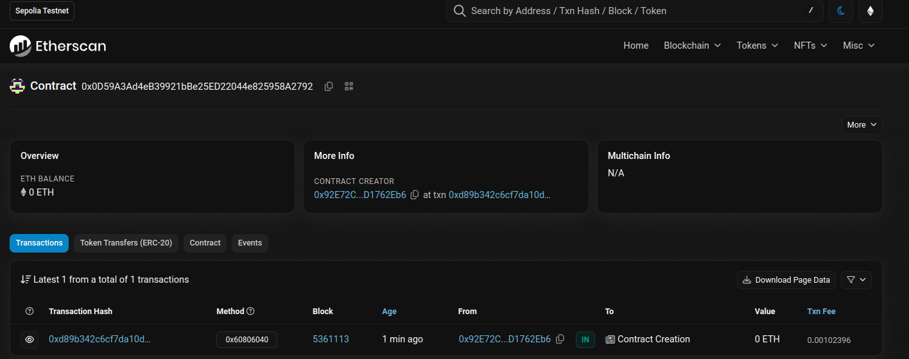

# 2024-Spring-HW0

All the detailed specified in Homework 0 documentation.

## Wallet Address
Please provide your MetaMask wallet address:

```
0x92E72Cc93e465810814F60957e08a8C8D1762Eb6
```

## Local Testing
Please provide a screenshot of the `forge test -vvv` command running in your local environment.



And, this is the screenshot of the deployment.



## Contract Address
Please provide the contract address that you deployed on the Sepolia network.

```
0x0D59A3Ad4eB39921bBe25ED22044e825958A2792
```

## Sepolia Etherscan
Paste the contract address into the Sepolia Etherscan and share the screenshot.

